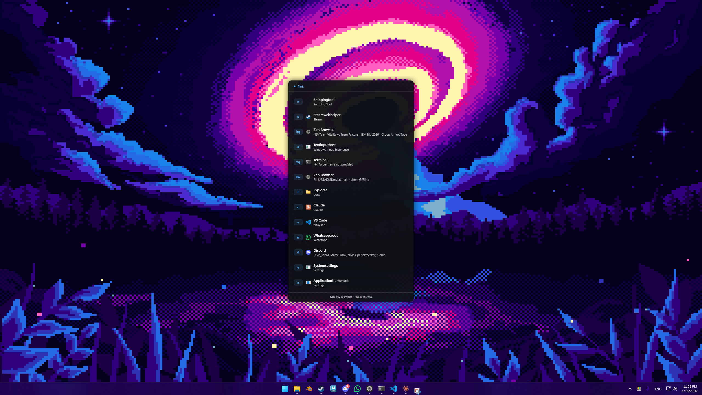

# Flink

A keyboard-driven Alt+Tab replacement for Windows. Press a key, switch windows — instantly.



---

## What it does

Flink replaces the default Alt+Tab switcher with a minimal overlay that assigns a letter to every open window. Press the letter, the window comes to the front. No mouse, no scrolling through a carousel.

- **Single window per app** → one key (`t` for Terminal)
- **Multiple windows** → two keys, second from the QWERTY row (`tq`, `tw`, `te` ...)
- **Type to filter** → press the first key, the list narrows to matching windows
- **Stable bindings** → once assigned, a window keeps its key for the entire session
- **Configurable** → pin any app to any letter, set display names

---

## Install

1. Download **`Flink-Setup.exe`** from [Releases](../../releases)
2. Run the installer — no admin rights required
3. Press **Alt+Tab** to open the switcher

No .NET Runtime required. The installer sets up a Start Menu entry and an optional autostart.

---

## Usage

| Action | Key |
|---|---|
| Open switcher | `Alt+Tab` |
| Switch to window | Type the shown key(s) |
| Back to full list | `Esc` |
| Dismiss | `Esc` (again) |

### Multi-window apps

When an app has more than one open window, Flink assigns two-letter bindings. The second letter follows the QWERTY row (`q w e r t y u i o p`, then home row, then bottom row) — keys that sit close together and are easy to hit in sequence.

```
t   →  Terminal (single window)

tq  →  Terminal — nvim
tw  →  Terminal — ssh prod
te  →  Terminal — logs
```

---

## Configuration

Config is created automatically on first run at `~/.flink/flink.json`.

```json
{
  "bindings": {
    "windowsterminal": "t",
    "zen":             "z",
    "code":            "c",
    "chrome":          "b",
    "msedge":          "e",
    "explorer":        "x"
  },
  "names": {
    "windowsterminal": "Terminal",
    "zen":             "Zen Browser",
    "code":            "VS Code",
    "chrome":          "Chrome",
    "msedge":          "Edge",
    "explorer":        "Explorer"
  },
  "followMouse": false,
  "autostart":   false,
  "theme":       "dark"
}
```

### Options

| Key | Type | Description |
|---|---|---|
| `bindings` | object | Map process name → fixed letter. Process names are lowercase, no `.exe`. |
| `names` | object | Map process name → display name shown in the overlay. |
| `followMouse` | bool | `true`: overlay appears on the monitor the mouse is on. `false`: always primary monitor. |
| `autostart` | bool | Launch Flink when Windows starts. Can also be toggled via the tray icon. |
| `theme` | string | `"dark"` (more coming) |

**Finding process names:** Open Task Manager → Details tab. The name without `.exe` is what goes in the config.

---

## Building from source

```
git clone https://github.com/t1mmyP/Flink
cd Flink
dotnet build
dotnet run
```

Requires [.NET 9 SDK](https://dotnet.microsoft.com/download/dotnet/9).

### Build installer locally

```
powershell -ExecutionPolicy Bypass -File build-installer.ps1
```

Requires [Inno Setup 6](https://jrsoftware.org/isdl.php). The script builds the release and compiles the installer in one step.

---

## How it works

Flink installs a low-level Windows keyboard hook (`WH_KEYBOARD_LL`) to intercept Alt+Tab before it reaches the system. The overlay window is pre-created at startup and only shown/hidden on demand — no creation overhead on keypress. Window focus is transferred via `AttachThreadInput` + `SetForegroundWindow`, which works reliably for both minimized and background windows.

---

## License

MIT
